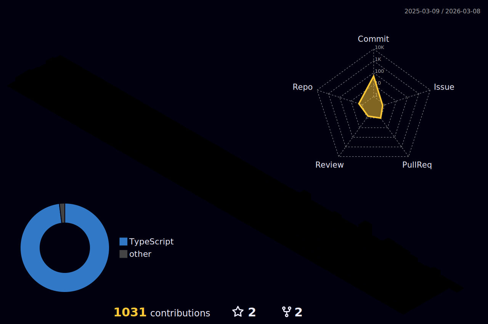

# Olá Devs, Stan aqui😄☕️
## Você chegou ao meu perfil do GitHub, fique a vontade e pode continuar...

- 🔭 Atualmente trabalho como Dev Front End.
- 🌱 Atualmente estou aprendendo AWS e Golang.
- 👯 Faço faculdade de sistemas web e ficaria feliz em conversar com alguém que também faz kkkk.
- 📫 Como entrar em contato comigo: Pode me chamar no Linkedin, Instagram ou Gmail, nessa ordem pois respondo mais rápido em algumas redes sociais especificas.
- ⚡ Curiosidade: Vejo animes, amo cultura japonesa e sou fã de jogos
 

  
 |  |  |  
 | ----------- | ----------- |

 
  

   

  

 
##
   

     
  

## Contato

  

