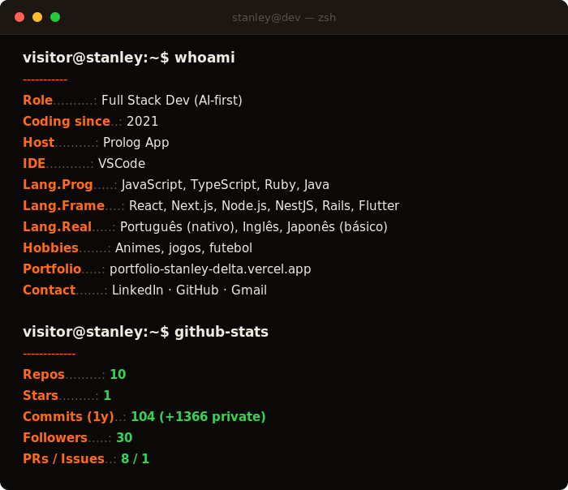
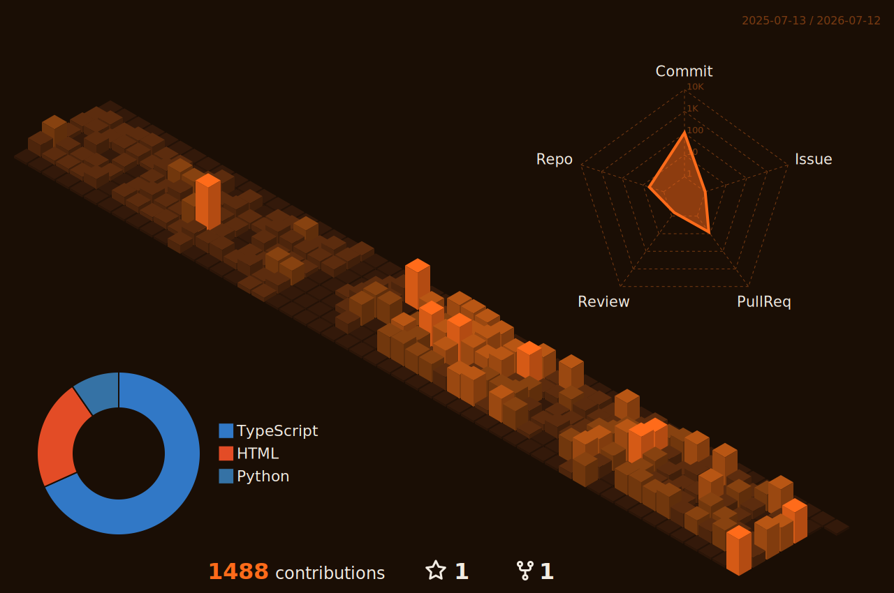

# Olá Devs, Stan aqui 😄☕

Dev Full-Stack Pleno-Sênior (React, Next.js, Node, Flutter), hoje com um fluxo de trabalho AI-first — da spec ao deploy. Fã de anime, cultura japonesa e uma boa dose de jogos.

🔗 **Portfólio:** [portfolio-stanley-delta.vercel.app](https://portfolio-stanley-delta.vercel.app)

- 🔭 Hoje trabalho como Dev Front-end Pleno na **Prolog App** (gestão de frotas), atuando também com Flutter e Java
- 🤖 Fluxo AI-first: uso Claude Code, Gemini e Codex da spec ao deploy — inclusive escrevendo as specs eu mesmo (o [portfólio](https://portfolio-stanley-delta.vercel.app) é um case disso)
- 🎓 Faço faculdade de Sistemas Web, hoje de olho no próximo passo: liderança técnica
- 🟢 Empregado atualmente, mas sempre aberto a trocar ideia sobre novos projetos e oportunidades
- 📫 Contato: portfólio, LinkedIn, GitHub ou Gmail, nessa ordem
- ⚡ Curiosidade: vejo animes, amo cultura japonesa e sou fã de jogos

 

📫 [Portfólio](https://portfolio-stanley-delta.vercel.app) · [LinkedIn](https://www.linkedin.com/in/stanley-brenner-dev/) · [Instagram](https://instagram.com/_staanb) · [Gmail](mailto:stanleybrenner@gmail.com)
